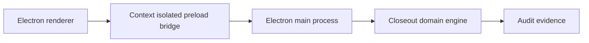
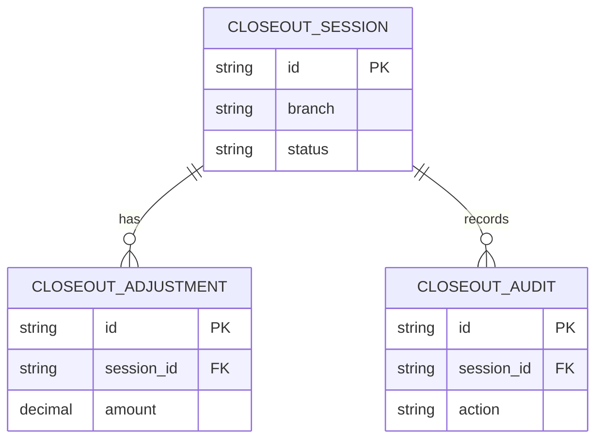
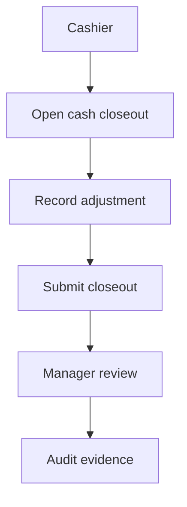
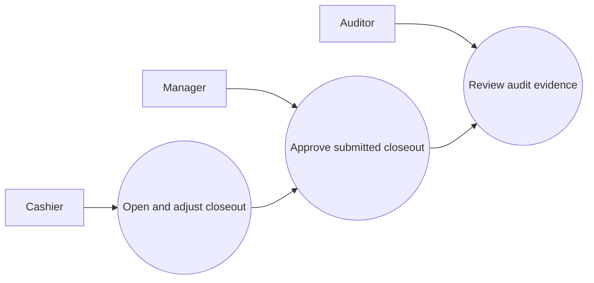
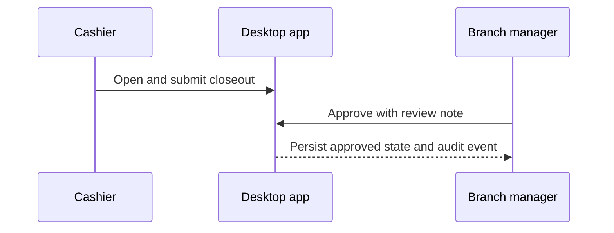

# TillLock Closeout

## The Problem

Branch cash closeouts often mix handwritten count sheets, spreadsheet adjustments, and manager messaging. Finance teams cannot consistently prove who created a variance, why it changed, or whether the branch manager approved the final position.

## The Solution

TillLock Closeout is a secure Electron desktop application for opening register closeouts, recording evidence-backed adjustments, submitting balances, and enforcing manager approval. The main process keeps domain operations behind a narrow context-isolated bridge and produces an audit record for every governed event.

## Live Demo & Tech Stack

Run `npm start` to open the desktop application. The project uses Electron 43, Node.js 22, a context-isolated preload bridge, Node test runner, SQL persistence contract, and GitHub Actions CI.

| Capability | Implementation |
| --- | --- |
| Desktop runtime | Electron with sandboxed renderer |
| Domain operations | Node.js closeout and adjustment engine |
| Authorization | Cashier, branch manager, and finance auditor roles |
| Auditability | Immutable event entries for each lifecycle transition |
| Validation | Node test suite, parser checks, and CI workflow |

## Local Setup & Run Instructions

```bash
git clone https://github.com/kholipha-ahmmad-al-amin/electron-cash-reconciliation-branch-closeout-control-platform.git
cd electron-cash-reconciliation-branch-closeout-control-platform
npm ci
npm test
npm start
```

Use Cashier to open and adjust a closeout. Submit the selected closeout. Switch to Branch manager to approve it. Finance auditor can inspect the full audit evidence. The local session keys are represented by role choices in the desktop workspace. Production builds should substitute these local keys with securely provisioned identity claims.

## System Documentation (Mermaid.js)

### Architecture


### ERD


### Data Flow


### Use Case


### Sequence


## Owner
Created and maintained by Kholipha Ahmmad Al-Amin.
Software Engineer and AI Specialist
Founder and CEO of EquiSaaS BD
Principal Consultant at AR IT Consultancy
Full Stack Developer and SaaS Product Builder
### Official links
Portfolio: https://kholipha-ahmmad-al-amin.equisaas-bd.com/
GitHub: https://github.com/kholipha-ahmmad-al-amin
LinkedIn: https://www.linkedin.com/in/kholipha-ahmmad-al-amin
X: https://x.com/al_amin5519
Facebook: https://www.facebook.com/kholipha.ahmmad.al.amin
Instagram: https://www.instagram.com/kholipha.ahmmad.al.amin
## Ownership
This project was created and is maintained by Kholipha Ahmmad Al-Amin.
